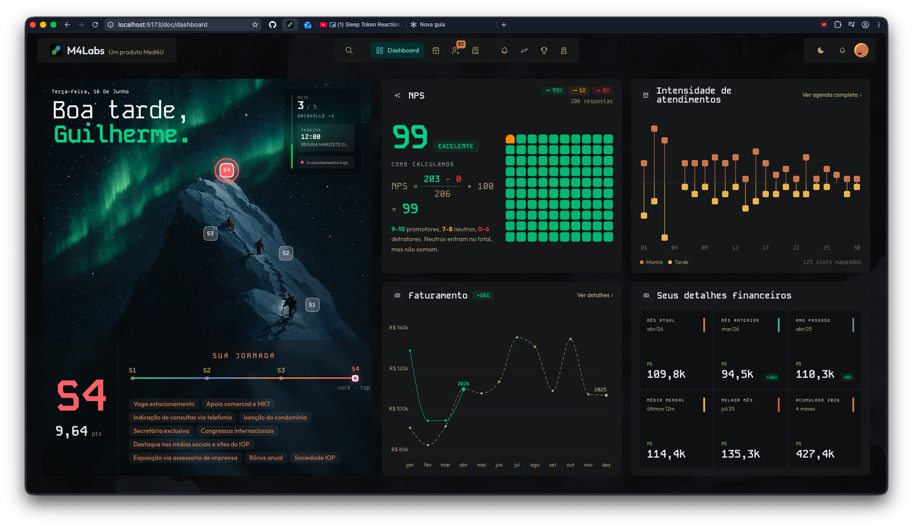
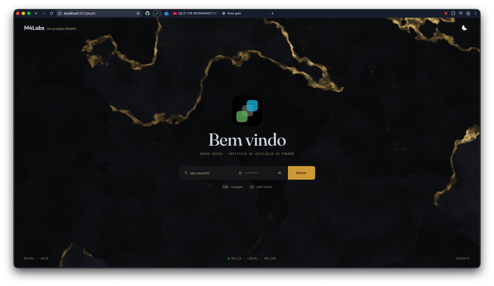

<div align="center">

# Guilherme Rodniski

**Full-Stack Engineer · Multi-Platform Architect · Design Systems**

I build products that scale from the browser to the pocket — one API contract, three native clients, zero drift.

[](https://www.linkedin.com/in/rodniski/)
[](https://instagram.com/rodniski)
[](https://github.com/rodniski)


</div>

---

## 👋 About

Full-stack engineer specialized in **multi-platform architecture** and **design systems**. Currently at **Grupo Med4U**, leading **M4Labs** — the monorepo that powers every digital product in the group, making sure **the same data, under the same contract, lands identical on the web, on iPhone, and on Android**.

The trick is a single source of truth: a **Protobuf/Connect** contract that codegens type-safe clients for **TypeScript, Swift, and Kotlin**, all talking to a **Go Backend-for-Frontend** that fans out to a fleet of **Go microservices** on **GKE**. No drift, no per-platform reimplementation.

Core strengths: **monorepos** (Turborepo/Bun), **type-safe RPC contracts** (Protobuf + Connect via `buf`), **Go microservices** (chi · pgx · slog · Clean Architecture), **native apps** (SwiftUI + Jetpack Compose), and **headless design systems**. I went from intern to tech lead in under two years, shipping corporate SaaS, ERP (Protheus) integrations, and an e-commerce that generated **R$6M+/year**.

`Multi-Platform` · `Monorepo` · `Go` · `Protobuf/Connect` · `SvelteKit` · `SwiftUI` · `Design Systems` · `GKE`

---

## 🚀 Featured

### 🔨 [Anvil](https://github.com/rodniski/anvil) — Native macOS build orchestrator · **Open Source**

[](https://github.com/rodniski/anvil/releases)
[](https://github.com/rodniski/anvil)
[](https://github.com/rodniski/anvil)
[](https://github.com/rodniski/anvil/blob/main/LICENSE)

A **SwiftUI** app that detects, configures, and runs builds across a multi-platform monorepo from one window. It auto-detects **iOS, Android, Bun, and Docker** components, discovers their schemes / flavors / scripts / services, and gives each one its own Build/Run with **live CPU & memory telemetry** — all wrapped in a hand-drawn blueprint aesthetic (SVG path tracing + a live Metal background).

> The tool I built to tame my own multi-platform workflow — and the clearest proof of what I do day to day.


### 🏗️ M4Labs — Multi-platform platform *(private · Grupo Med4U)*

> One Protobuf contract, a Go edge, three native clients, zero drift. The foundation behind every Med4U digital product.



```
proto (labs.v1)  ──[ buf generate ]──►  type-safe Connect clients
  ├── Web      protoc-gen-es   →  TypeScript + @connectrpc/connect-web   (SvelteKit)
  ├── iOS      connect-swift   →  M4DocKit                               (SwiftUI)
  └── Android  connect-kotlin  →  (Jetpack Compose)
                          │
            Go BFF  (bff/labs · Connect edge: JWT + scopes + proto mapping)
                          │
            Go microservices  (chi · pgx · slog)  ──►  Helix gRPC  ──►  Oracle / Tasy
                                                    └►  PostgreSQL
```

| Layer | Tech |
|---|---|
| Monorepo | Turborepo + Bun |
| Web | SvelteKit 2 · Svelte 5 · Tailwind 4 |
| iOS | SwiftUI (iOS 26) · connect-swift |
| Android | Jetpack Compose · Material 3 |
| API contract | Protobuf + Connect (`buf`, protoc-gen-es / connect-swift) |
| BFF | Go · chi · Connect · JWT edge |
| Services | Go microservices · pgx · slog · Clean Architecture |
| Data | Oracle/Tasy via Helix gRPC · PostgreSQL |
| State | TanStack Query + Svelte runes (web) · `@Observable` (iOS) |
| Design System | shadcn-svelte → *Travertino & Pátina* (web) · *Lumen* (iOS) |
| Infra | GKE Autopilot · Terraform · Workload Identity · Cloud SQL |
| CI/CD | GitHub Actions · per-service deploy · Trivy / SBOM / cosign |

**Backbone**
- **bff/labs** — the Go Backend-for-Frontend: the single Connect edge for web + iOS + Android. Validates the JWT (httpOnly cookie for web, bearer for mobile), enforces per-RPC scopes, fans out to domain services, and maps internal protos → public `labs.v1`. Zero domain logic, no database.
- **Go service fleet** — `auth` (LDAP/AD + JWT), `helix` (gRPC gateway to Oracle/Tasy), `m4doc/{paciente,faturamento,nps}`, `m4admin/{alteracoes,encarreiramento,notification,obits}`, `monitor-pacientes`. Each is Clean Architecture: chi · pgx · slog · Connect.
- **Travertino & Pátina** — headless design system on top of shadcn-svelte: canonical semantic tokens, elevation-by-tone (no borders), `motion-sv` springs, `layerchart` dataviz.

**Apps**
- **labs (web)** — SvelteKit medical portal: doctor dashboard (KPI strips, NPS trend, billing candle charts), an agenda timeline with a free-text clinical-evolution (RTF→text) parser, GED document preview, and a command palette. Talks to the Go BFF over `connect-web`, cached with TanStack Query.
- **food (web)** — iFood IOP ordering PWA (SvelteKit + DaisyUI).
- **m4doc (iOS)** — native SwiftUI app, `connect-swift` straight to the BFF, custom GLSL→Metal shader background, *Lumen* theme.
- **m4doc (Android)** — native Jetpack Compose app, Material 3.



---

## 🧬 Stack

<div align="center">

**Frontend & Mobile**


**Backend & Contracts**


**Infra & Tooling**


</div>

---

## 📂 Earlier work

<details>
<summary><b>RodoApp</b> — Corporate SaaS</summary>
<br>

Internal platform: corporate email-signature generator, tire-dispatch control with tracking, pre-document posting integrated with the Protheus ERP, and integration with TOTVS and ConexaoNFE web services for XML processing. Frontend in Next.js + shadcn/ui + Tailwind CSS.

</details>

<details>
<summary><b>SystemWiser</b> — HR Portal & Website</summary>
<br>

**HR Portal (Unibraspe):** online payslip generation, time-bank control, and income-statement issuing.

**Official Website:** institutional site with responsive design, optimized SEO (high Lighthouse score), and animations with Framer Motion + Lottie.

</details>

<details>
<summary><b>Ecoflow</b> — Shopify E-commerce · R$6M+/year</summary>
<br>

Shopify store integrated via Lexos for marketplaces and the Protheus ERP. End-to-end automation of orders, inventory, and billing — a success case blending technology, automation, and sales strategy.

</details>

---

## 📊 GitHub

<div align="center">


</div>

---

<div align="center">

*Always chasing the next architectural challenge.* 🧱

</div>
